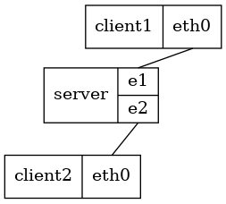

Qeneth
======

String together QEMU VMs with UDP sockets using graphviz(7),
mustache(1) and duct tape.

```
               .--------.
    Graph ---> |        |      .---------------------.
               | qeneth | ---> | qemu-system-${ARCH} |-.
Templates ---> |        |      '---------------------' |-.
               '--------'        `---------------------' |
                                   `---------------------'
```

`qeneth` starts from an undirected graphviz(7) **Graph** of "record
nodes". The graph is analyzed, annotated with information, and split
into per-node YAML documents. Finally, these documents are filtered
through one or more mustache(1) **Templates** to create executable
scripts. Typically the generated script will launch an instance of
`qemu-system-${ARCH}`, but it could be anything.

Some basic process monitoring is available, but the executables can
also be run manually or through some other process monitor.


Installation
------------

Clone the repository and place `qeneth` is in your `$PATH`.


Tutorial
--------

This example uses qeneth's built-in template for generating [NetBox][]
VMs. Let's start by creating our directory where all files related to
our network will be stored, and download a pre-built NetBox image into
it:

```
~$ mkdir my-network
~$ cd my-network/
~/my-network$ wget -q https://nightly.link/westermo/netbox/workflows/nightly-os/master/netbox-os-zero.zip
~/my-network$ unzip netbox-os-zero.zip netbox-os-zero.img
Archive:  netbox-os-zero.zip
  inflating: netbox-os-zero.img
~/my-network$ rm netbox-os-zero.zip
```

Next, let's setup our topology, saving it as `topology.dot.in`:

```
~/my-network$ cat topology.dot.in
graph "my-network" {
        node [shape=record];
        qn_template="netbox-os-zero";

        server [label="server | { <eth0> eth0 | <eth1> eth1 }"];
        client1 [label="client1 | { <eth0> eth0 }"];
        client2 [label="client2 | { <eth0> eth0 }"];

        server:eth0 -- client1:eth0;
        server:eth1 -- client2:eth0;
}
```

Use your favorite graphviz(7) layout engine to visualize it:



Everything we need is in place - now we can generate the executables:

```
~/my-network(v) qeneth generate
Info: Generating topology
Info: Generating node YAML
Info: Generating executables
~/my-network$ ls
client1       client2       netbox-os-zero.img  server.yaml   topology.dot.in
client1.yaml  client2.yaml  server              topology.dot
```

Finally, we can start our network:

```
~/my-network$ qeneth start
Info: Launching server
Info: Launching client1
Info: Launching client2
~/my-network$ qeneth status
NODE           PID  CNSOL  MONTR
server     2811526  10000  10001
client1    2811527  10010  10011
client2    2811528  10020  10021
```

After this we can attach to the different nodes and poke around:

```
~/my-network$ qeneth console server
Trying ::1...
Connected to localhost.

NetBox - The Networking Toolbox
zero login: root
root@zero:~# ip -br link
lo               UNKNOWN        00:00:00:00:00:00 <LOOPBACK,UP,LOWER_UP>
dummy0           DOWN           72:05:a3:d8:04:1e <BROADCAST,NOARP>
eth0             UP             02:00:00:00:02:00 <BROADCAST,MULTICAST,UP,LOWER_UP>
eth1             UP             02:00:00:00:02:01 <BROADCAST,MULTICAST,UP,LOWER_UP>
gre0@NONE        DOWN           0.0.0.0 <NOARP>
gretap0@NONE     DOWN           00:00:00:00:00:00 <BROADCAST,MULTICAST>
erspan0@NONE     DOWN           00:00:00:00:00:00 <BROADCAST,MULTICAST>
ip_vti0@NONE     DOWN           0.0.0.0 <NOARP>
ip6tnl0@NONE     DOWN           :: <NOARP>
br0              UP             02:00:00:00:02:00 <BROADCAST,MULTICAST,UP,LOWER_UP>
vlan1@br0        UP             02:00:00:00:02:00 <BROADCAST,MULTICAST,UP,LOWER_UP>
root@zero:~#
telnet> Connection closed.
```

When we are done, we stop all the nodes:

```
~/my-network$ qeneth stop
Info: Stopping server
Info: Stopping client1
Info: Stopping client2
```

[NetBox]: https://github.com/westermo/netbox
